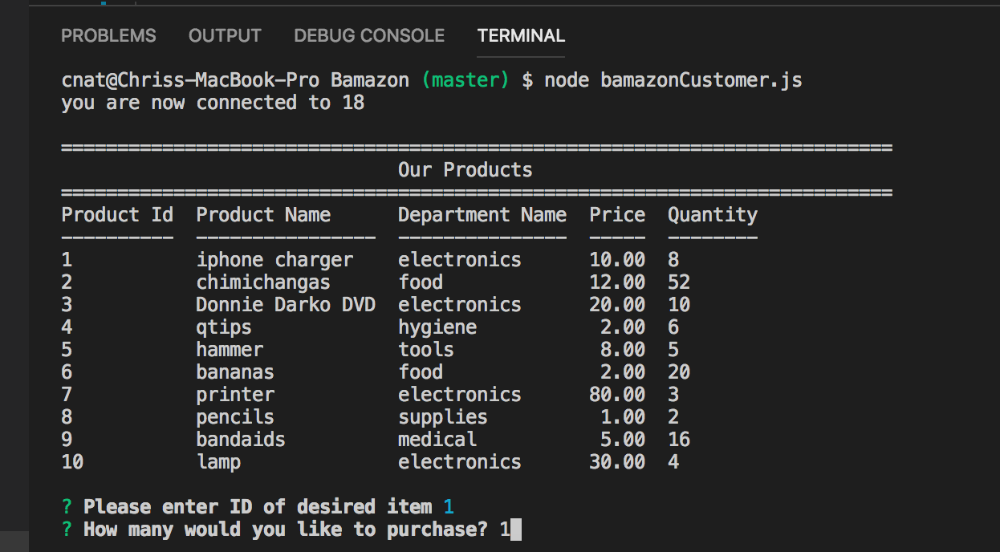
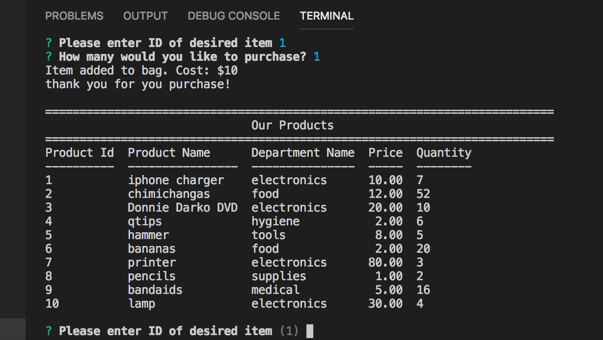
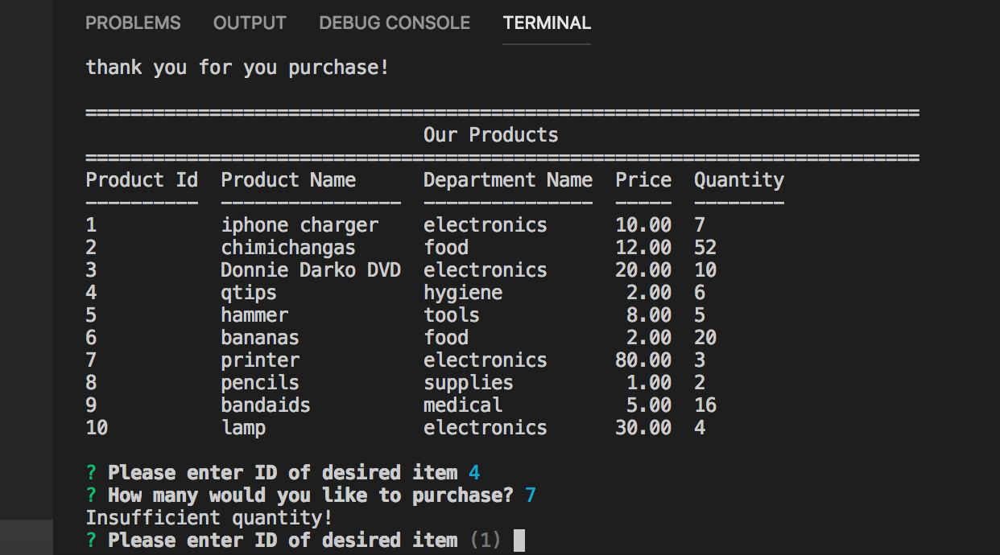

# Bamazon

In this application Bamazon, you will be able to browse a database and purchase your desired items.

How to use:

When the program is first ran it will display all of the stock with their ID number, name, stock quantity, department, and their price. You will asked of your desired product and will need to specify it by name

After ID and quantity is selected it will check if there is enough stock and return the price and total cost

if there is not enough stock it will alert you and advise you to select another item

